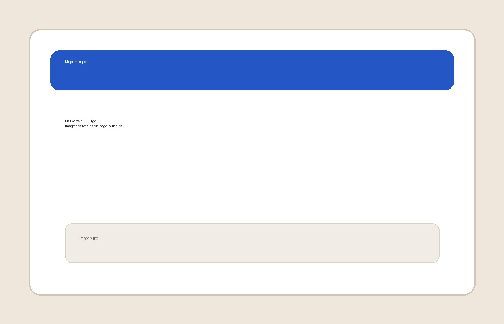

Este es un post de ejemplo para comprobar el flujo de trabajo con Joplin y Hugo.



## Lista

- Escribir en Markdown
- Copiar el contenido al bundle
- Mantener las imágenes en la misma carpeta

## Código

```bash
hugo server
```

## Tabla

| Campo | Valor |
| --- | --- |
| Tema | Simple |
| Flujo | Markdown + imágenes locales |

> Las imágenes se adaptan al ancho del contenido sin necesidad de HTML adicional.

