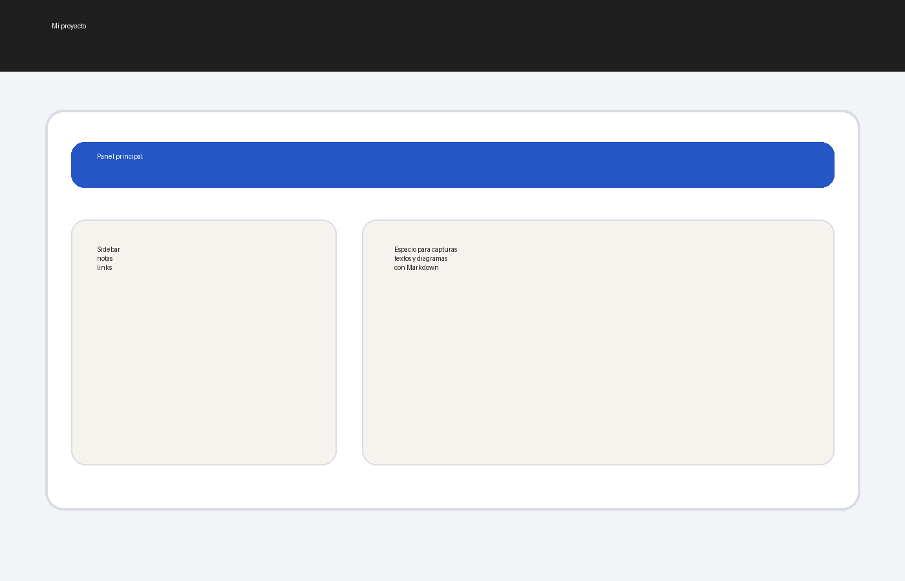

Este proyecto de ejemplo muestra cómo documentar una idea, explicar qué resuelve y enlazar recursos.

Puedes añadir enlaces directos:

- [Repositorio](https://example.com)
- [Demo](https://example.com/demo)

También puedes mezclar texto normal, listas y citas para que cada proyecto tenga contexto suficiente.

